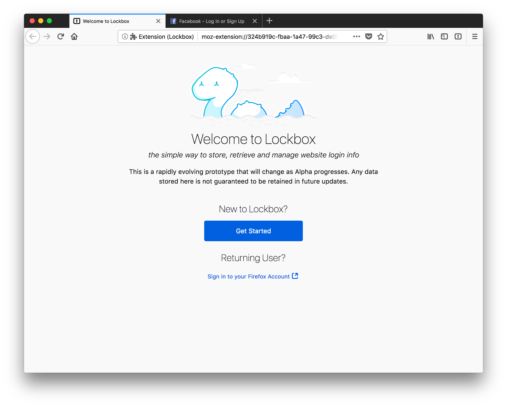
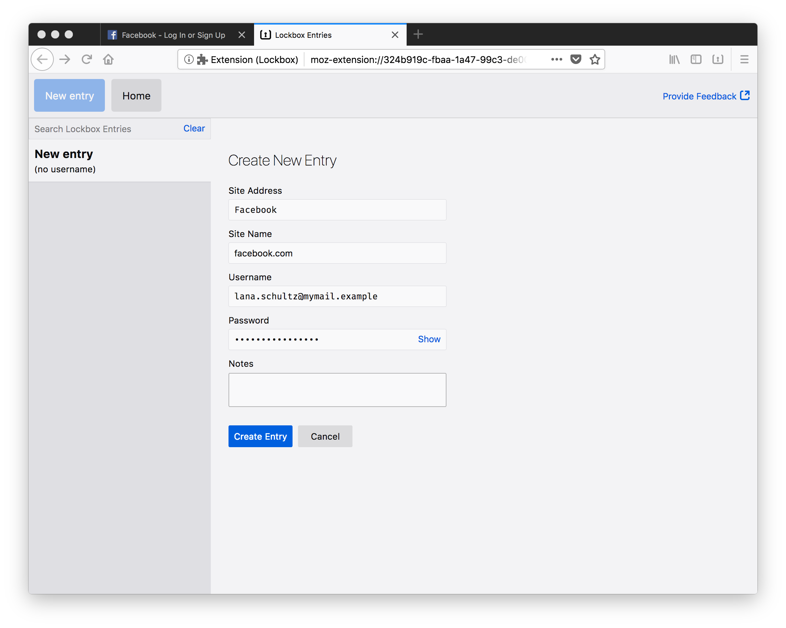
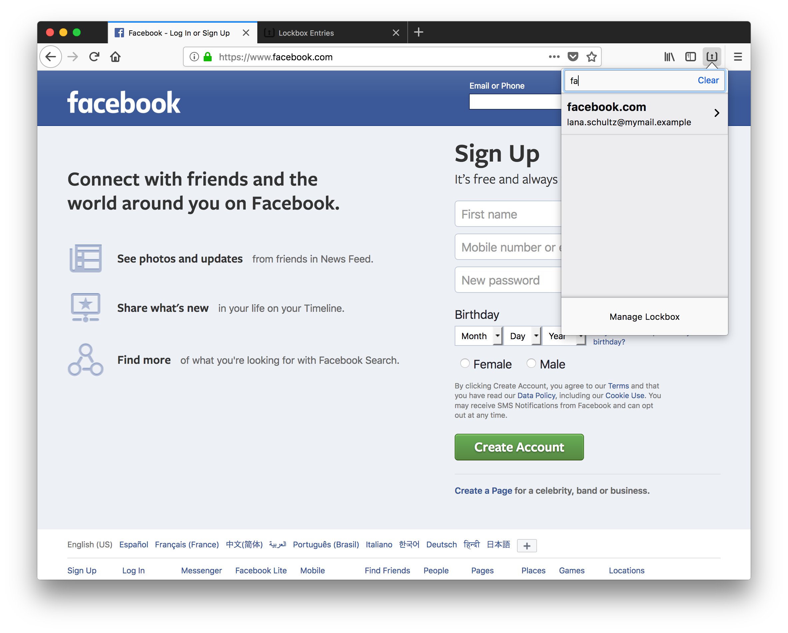
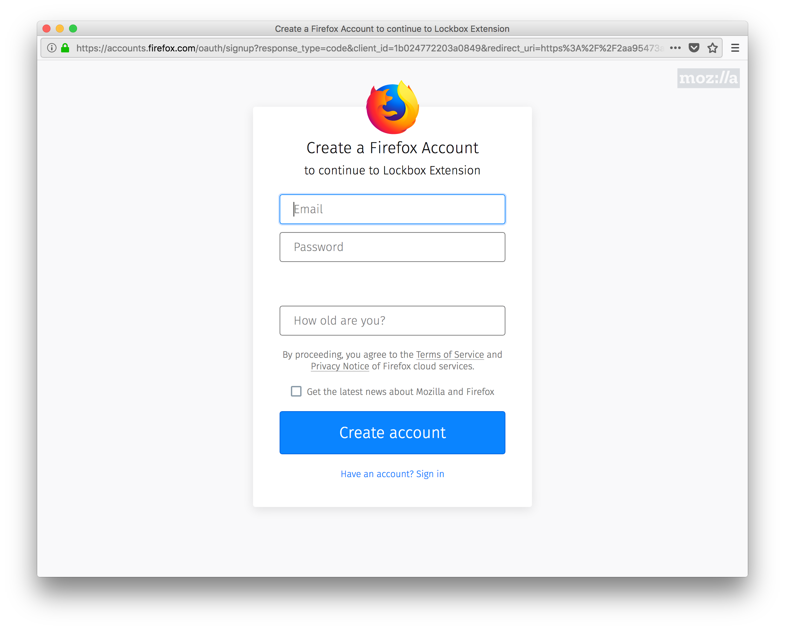

# Lockbox for desktop

!!! right "Install the extension"
    [Install Lockbox][install-link]{: .button-link }
    Have questions about how Lockbox works? [Check out the FAQs][faq-link]

!!! right "Contribute"
    You can also contribute by:
    
    - Developing code
    - Reporting bugs
    
    [Learn how to get started][contribute-link]

The Lockbox extension is a simple, stand-alone password manager that works
with Firefox for desktop. It’s the first of several planned experiments
designed to help us test and improve password management and online
security.

Install it and sign in with your Firefox Account to encrypt your data with
tamper-resistant block cipher technology. Then [share feedback
here](feedback-link).

## Get Started

1. Install Lockbox, and it will automatically disable Firefox’s password manager.
   

2. Create an entry with a website name, URL, username, and password.
   

3. Search or browse in the toolbar menu or on the full tab to find the password you need.
   

4. Sign up or sign in with a Firefox Account to encrypt your entries.
   

_This is just one component of the Lockbox product. Please see the [Lockbox
website][website-link] for more documentation and context._

[install-link]: https://testpilot.firefox.com/files/lockbox@mozilla.com/latest
[faq-link]: /faqs/
[contribute-link]: /contributing/ 
[website-link]: https://mozilla-lockbox.github.io/
[feedback-link]: https://qsurvey.mozilla.com/s3/Lockbox-Input
